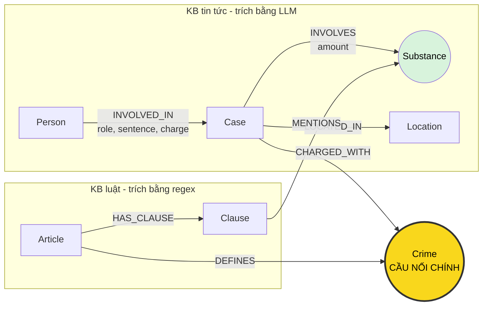

# Thiết kế Ontology — Day 19

**Họ tên:** Nguyễn Tú Tài  **MSSV:** 2A202602455

**Lựa chọn** (đánh dấu một):
- [x] Dùng ontology gợi ý (có bổ sung chiến lược truy hồi theo loại câu hỏi)
- [ ] Tự thiết kế (xét bonus +15, xem `SUBMISSION.md`)

## 1. Sơ đồ

`Crime` là cầu nối chính giữa KB tin tức và KB luật. `Substance` là cầu nối phụ để chọn các khoản luật có nhắc tới loại ma túy trong vụ án.

## 2. Entity types (node labels)

| Label | Ý nghĩa | Khóa định danh (`MERGE` theo) | Properties | Lấy từ KB nào | Trích bằng |
| --- | --- | --- | --- | --- | --- |
| `Article` | Một Điều luật | `id`, ví dụ `Điều 251 BLHS` | `title`, `law`, `doc_id` | Luật | Front matter + regex |
| `Clause` | Một khoản trong Điều luật | `id`, ví dụ `Điều 251 BLHS khoản 1` | `number`, `penalty`, `text`, `doc_id` | Luật | Regex theo dòng bắt đầu bằng `1.`, `2.`... |
| `Crime` | Tội danh chuẩn hóa | `name` | `name` | Cả luật và tin | Tiêu đề Điều luật; tin do LLM trích rồi `link_entity` về danh sách chuẩn |
| `Case` | Một vụ việc/vụ án được bài báo mô tả | `name` | `summary`, `date`, `source_title`, `doc_id` | Tin | LLM JSON |
| `Person` | Người tham gia vụ việc | `name` | `aliases` | Tin | LLM JSON |
| `Substance` | Loại chất ma túy | `name` chuẩn khi map được, ví dụ `MDMA`, `Ketamine`; tên ngoài danh sách giữ dạng LLM đã chuẩn hóa | `name` | Cả luật và tin | Luật: dò danh sách; tin: LLM rồi chuẩn hóa tên/đồng nghĩa |
| `Location` | Địa điểm chính của vụ việc | `name` | `name` | Tin | LLM JSON |

`Article`, `Clause` và `Case` mang `doc_id` của tài liệu nguồn để nối kết quả vector search với graph. `Crime` và `Substance` là node dùng chung giữa nhiều tài liệu nên không gắn một `doc_id` duy nhất.

## 3. Relationships

| Type | Từ → Đến | Properties trên cạnh | Ý nghĩa |
| --- | --- | --- | --- |
| `DEFINES` | `Article` → `Crime` | Không | Điều luật định nghĩa tội danh |
| `HAS_CLAUSE` | `Article` → `Clause` | Không | Điều luật có khoản |
| `MENTIONS` | `Clause` → `Substance` | Không | Khoản luật nhắc tới chất/nhóm chất |
| `CHARGED_WITH` | `Case` → `Crime` | Không | Vụ việc bị điều tra/truy tố/xét xử về tội danh |
| `INVOLVES` | `Case` → `Substance` | `amount` | Vụ việc liên quan tới loại và khối lượng chất |
| `LOCATED_IN` | `Case` → `Location` | Không | Địa điểm chính của vụ việc |
| `INVOLVED_IN` | `Person` → `Case` | `role`, `sentence`, `charge` | Vai trò, mức án và tội danh riêng của một người trong vụ |

## 4. Node cầu nối giữa 2 KB

- **Node chính:** `Crime`.
- **Vì sao chọn:** tên tội xuất hiện ở tiêu đề Điều luật và trong bài báo; từ một vụ án có thể đi qua `CHARGED_WITH` → `Crime` ← `DEFINES` để tới đúng `Article`.
- **Cách đảm bảo khớp tên:** tên tội ở luật được chuẩn hóa bằng `normalize_crime`; prompt tin tức nhận danh sách tội chuẩn; kết quả LLM vẫn đi qua `link_entity`, khớp chính xác sau chuẩn hóa trước rồi mới fuzzy match với `cutoff=0.8`.
- **Cầu phụ:** `Substance` nối `Case` với `Clause`, giúp giữ các khoản có nhắc tới chất trong vụ án. Tên chất do LLM trả về được map về `SUBSTANCES`; các biến thể như `thuốc lắc`/`MDMA`, `ketamin`/`Ketamine` được chuẩn hóa. Tên không đủ gần danh sách chuẩn (graph hiện có `etomidate`, `ma túy`) được giữ lại để không mất bằng chứng nguồn, nhưng không dùng làm cầu nối khoản luật.
- **Khi cầu gãy:** LLM trả tội ngoài danh sách, tên quá khác, JSON sai, hoặc bài chỉ nói hành vi mà không đủ căn cứ gán tội. Hệ thống không nối bừa; `link_entity` trả `None`. Cách xử lý là xem output JSON của bài lỗi, bổ sung alias/danh sách chuẩn hoặc sửa prompt, sau đó dựng lại graph.

## 5. Competency questions

| Câu | Đường đi (Cypher pattern) | Trả lời được? |
| --- | --- | --- |
| Q1 | `(:Article {id:'Điều 2 Luật PCMT'})-[:HAS_CLAUSE]->(:Clause {number:4})` | Có. `Clause.text` chứa định nghĩa “tiền chất”. |
| Q2 | `(:Person)-[r:INVOLVED_IN {sentence:'tử hình'}]->(:Case {doc_id:'news-100260928173914514'})` | Có. Lấy các `Person.name` có mức án tử hình trong đúng bài báo. |
| Q3 | `(:Person {name:'Lê Minh Thành'})-[r:INVOLVED_IN]->(:Case)-[:CHARGED_WITH]->(:Crime)<-[:DEFINES]-(:Article {id:'Điều 251 BLHS'})-[:HAS_CLAUSE]->(:Clause {number:1})` | Có. `r.sentence` cho 36 tháng; `Crime`, `Article` và khoản 1 cho tội, Điều luật, khung cơ bản. |
| Q4 | `(p:Person)-[:INVOLVED_IN]->(:Case)-[:CHARGED_WITH]->(:Crime)<-[:DEFINES]-(:Article {id:'Điều 255 BLHS'})-[:HAS_CLAUSE]->(:Clause) WHERE 'Hoàng Nato' IN p.aliases` | Có. Khi câu hỏi có “tối đa”, `context()` lấy mọi khoản và thấy khoản 4 có tù chung thân. |
| Q5 | `(:Person {name:'Cái Quang Huy'})-[:INVOLVED_IN]->(k:Case)-[i:INVOLVES]->(s:Substance {name:'MDMA'})` và `(k)-[:CHARGED_WITH]->(:Crime)<-[:DEFINES]-(:Article {id:'Điều 250 BLHS'})-[:HAS_CLAUSE]->(cl:Clause)-[:MENTIONS]->(s)` | Có. Cạnh `i.amount` cho hơn 9,6kg; văn bản các khoản cho thấy MDMA từ 100g thuộc khoản 4. |
| Q6 | `(s:Substance {name:'MDMA'})<-[:INVOLVES]-(k:Case)<-[:INVOLVED_IN]-(p:Person)` | Có. Truy vấn tổng hợp lấy mọi vụ trong graph liên quan MDMA, không chỉ các chunk top-k. |

## 6. Quyết định thiết kế và đánh đổi

1. **Chọn `Crime` làm cầu nối chính.** Phương án khác là nối trực tiếp `Case` → `Article`; cách đó phụ thuộc LLM đoán số Điều và dễ sai. Cầu `Crime` cho phép luật cung cấp tên chuẩn và tái sử dụng cùng một node cho nhiều vụ.
2. **Tách `Clause` thành node thay vì lưu toàn bộ Điều trong một property.** Graph lớn hơn và prompt có thể dài hơn, nhưng trả lời được khung hình phạt theo từng khoản và Q5 cần so khối lượng với khoản luật.
3. **Regex cho luật, LLM cho tin.** Dùng LLM cho cả hai sẽ tốn tiền và không ổn định; dùng regex cho tin khó bắt quan hệ người–mức án–tội danh trong văn xuôi. Thiết kế lai tận dụng cấu trúc đều của luật và khả năng hiểu ngữ cảnh của LLM ở tin tức.
4. **Giữ khối lượng dưới dạng chuỗi trên cạnh `INVOLVES`.** Phương án khác là parse về gam và tạo node ngưỡng. Chuỗi giữ đúng bằng chứng nguồn và triển khai đơn giản, nhưng việc chọn khoản chính xác vẫn dựa vào LLM đọc `amount` cùng văn bản khoản.
5. **Truy hồi khoản theo ý định câu hỏi.** Câu hỏi “khung cơ bản” chỉ lấy khoản 1; câu hỏi “tối đa/cao nhất” lấy mọi khoản; câu có chất lấy khoản 1 và các khoản `MENTIONS` chất đó; câu tổng hợp theo chất bỏ phần luật để giảm nhiễu và token.

## 7. So với ontology gợi ý

Không xét bonus: graph dùng đúng các label và relationship của ontology gợi ý. Phần bổ sung chỉ là chuẩn hóa alias chất và chiến lược truy hồi trong `context()`, không được xem là một ontology khác.

## 8. Hạn chế còn lại

- `Case.name` và `Person.name` do LLM sinh ra vẫn có thể làm trùng thực thể hoặc nhập nhầm hai người trùng tên.
- `amount` chưa được chuyển thành số và đơn vị chuẩn, nên graph chưa tự tính chắc chắn khoản luật theo ngưỡng khối lượng.
- Giai đoạn tố tụng (bắt, khởi tố, truy tố, sơ thẩm, phúc thẩm) mới nằm trong văn bản/role, chưa được mô hình hóa thành node hoặc relationship riêng.
- `Clause` nối với chất theo việc tên chất xuất hiện trong văn bản; một khoản có nhiều ngưỡng nên truy hồi vẫn cần LLM đọc và chọn điều kiện phù hợp.
